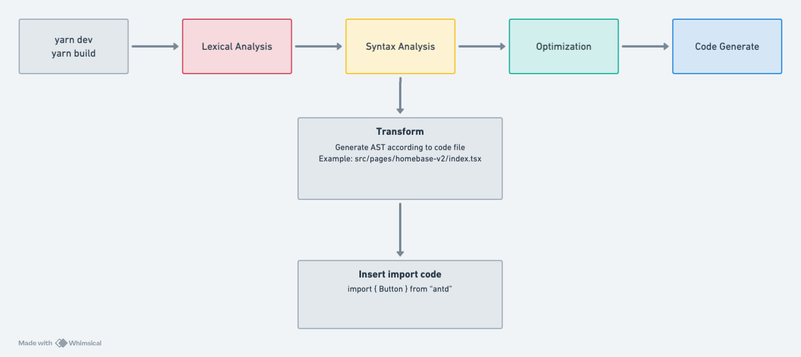
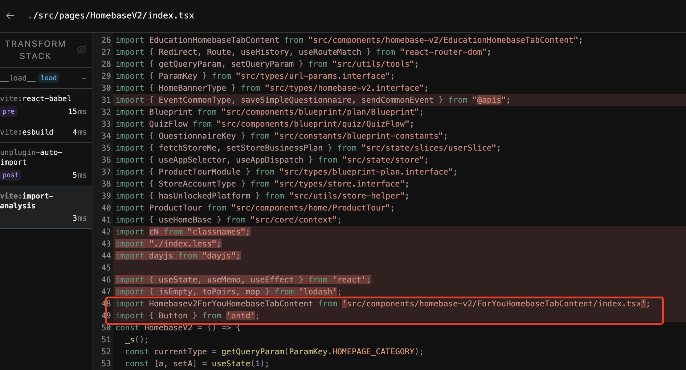
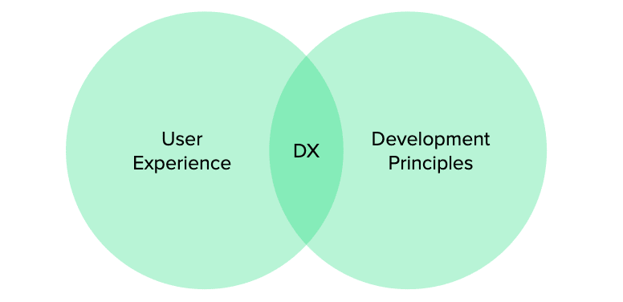

# pietra auto import

`@pietra/auto-import` 是一个 Vite Plugin，它可以让我们在项目中自动引入一些顶级的库或者工具以及我们内部的 Components, Icons，例如 Antd, Lodash, React API 等等。

## 现状

开始正式介绍之前，我们先来看看 pietra creator 项目中随便一个文件的顶部的 `import`:

```ts
import { lazy, useEffect, useMemo, useRef } from 'react'
import HomeBanner from 'src/components/homebase-v2/HomeBanner'
import { Redirect, Route, useHistory, useRouteMatch } from 'react-router-dom'
import { getQueryParam, setQueryParam } from 'src/utils/tools'
import { ParamKey } from 'src/types/url-params.interface'
import { HomeBannerType } from 'src/types/homebase-v2.interface'
import {
  EventCommonType,
  saveSimpleQuestionnaire,
  sendCommonEvent,
} from '@apis'
import _ from 'lodash'
import Blueprint from 'src/components/blueprint/plan/Blueprint'
import QuizFlow from 'src/components/blueprint/quiz/QuizFlow'
import { QuestionnaireKey } from 'src/constants/blueprint-constants'
import { fetchStoreMe, setStoreBusinessPlan } from 'src/state/slices/userSlice'
import { useAppSelector, RootState, useAppDispatch } from 'src/state/store'
import { SimpleQuestionnaireInputItem } from 'src/types/api/store.interface'
import {
  BusinessPlan,
  ProductTourModule,
} from 'src/types/blueprint-plan.interface'
import { StoreAccountType, StoreMe } from 'src/types/store.interface'
import { hasUnlockedPlatform } from 'src/utils/store-helper'
import ProductTour from 'src/components/home/ProductTour'
import { useHomeBase } from 'src/core/context'
import cN from 'classnames'
import { includes } from 'lodash'
import './index.less'
import dayjs from 'dayjs'
```

这么一看，import 的代码竟然占据了 29 行。我们先来分析一下，除了我们导入内部的文件之外（src 文件夹下），其他的基本上都是非常通用的导入，例如：

```ts
import { lazy, useEffect, useMemo, useRef } from 'react'
import { Redirect, Route, useHistory, useRouteMatch } from 'react-router-dom'
import cN from 'classnames'
import { includes } from 'lodash'
```

这些都是来自使用频率非常高的第三方库，我们每次都需要重复书写这些代码，那么有没有办法能够自动导入这些库呢？

## 理想的使用方式

什么是自动导入？即是说不用手动书写以上这些 import 语句，直接在代码中使用对应的 API，例如：

```tsx
// without these code:
// import { map } from "lodash"
// import { Button } from "antd"
// import { useState, useEffect } from "react"

function Example() {
  const [count, setCount] = useState(0)

  useEffect(() => {
    const arr = [1, 2, 3, 4, 5]
    map(arr, (item) => {
      console.log('item:', item)
    })
  }, [])

  return (
    <>
      <Button type="primary" />
    </>
  )
}
```

事实上，在 pietra 项目中我们频繁使用的第三方库包括: react, react-router, react-router-dom, antd, lodash, classnames 等等（暂且统计这 6 个）。如果这些库都能做到自动导入那就非常棒了。

## 更进一步

我们接着分析，除了第三方库之外，可以发现其实我们在顶部也导入了很多内部文件，例如 `src/components` 等。如果也能自动导入，那就更棒了！

```tsx
// without these code:
// import IconsArrowButtonRightIcon from 'src/components/icons/ArrowButtonRightIcon';
// import ForYouHomebaseTabContent from 'src/components/homebase-v2/ForYouHomebaseTabContent';

function Example() {
  ...
  return (
    <>
    <IconsArrowButtonRightIcon />
    <ForYouHomebaseTabContent />
    </>
  )
}
```

这个时候，你可能会想我们现在的项目都是用 typescript 写的，如果没有 import 语句，eslint 会提示 `no-undef`的错误， 如果我们能一并解决这个问题那就更好了！

## @pietra/auto-import

为了解决以上我们提出的问题， `@pietra/auto-import`来了。接下来正式介绍 `@pietra/auto-import` 的使用：

```bash
yarn add @pietra/auto-import -D
```

```ts
//vite.config.ts
import { pietraAutoImport } from '@pietra/auto-import'

// https://vitejs.dev/config/
export default defineConfig({
  plugins: [
    ...pietraAutoImport({
      include: [/\.[tj]sx?$/],
      dts: './pietra-auto-imports.d.ts',
      eslintrc： './.eslintrc-pietra-auto-import.json',
      presets: {
        react: true,
        reactRouter: true,
        antd: true,
        lodash: true,
        classnames: true,
        reactRouterDom: true,
        pietraCompoent: true,
      },
    }),
  ],
})
```

介绍一下每个字段的含义：

- `include`: 用于匹配需要做自动导入的文件类型。
- `d.ts` 和 `eslintrc`: 刚刚提到，我们同时也要解决 eslint 报错的问题。对于这个问题，我们会通过 `dts` 字段指定一个后缀为 `d.ts` 的文件名，`eslintrc`指定一个后缀为 `.json` 的文件名，当我们运行或者打包的时候，会在指定位置生成对应的文件，我们只需要把 `./pietra-auto-imports.d.ts` 文件加入到 `tsconfig`的 `include`, 把 `./.eslintrc-pietra-auto-import.json` 文件加入到 `.eslintrc.js` 即可：

```json
// tsconfig.json
{
  ...
  "include": [
    "./src",
    "types.d.ts",
    "pietra-auto-imports.d.ts",
    "tests"
  ]
}
```

```js
// .eslintrc.js
module.exports = {
 ...
  extends: [
    ...
    './.eslintrc-pietra-auto-import',
  ],
  ...
};
```

生成的 `./pietra-auto-imports.d.ts` 代码示例如下：

```ts
/* eslint-disable */
/* prettier-ignore */
// @ts-nocheck
// noinspection JSUnusedGlobalSymbols
// Generated by @pietra/auto-import
export {}
declare global {
  ...
  const Count: typeof import("@/components/Count.tsx")["Count"];
  const createRef: typeof import("react")["createRef"];
  const forwardRef: typeof import("react")["forwardRef"];
  const useId: typeof import("react")["useId"];
  const useImperativeHandle: typeof import("react")["useImperativeHandle"];
  ...
}
```

生成的 `./.eslintrc-pietra-auto-import.json` 代码示例如下：

```json
{
  "globals": {
    ...
    "useRef": true,
    "useResolvedPath": true,
    "useRoutes": true,
    "useSearchParams": true,
    ...
  }
}
```

- `presets`: 表示需要自动导入的库。（`pietraCompoent: true` 表示自动导入 `src/components`目录下面的组件）。

## 简单讲一下原理

现代的前端项目几乎都是基于构建工具之上的，例如 Webpack、Vite、Rollup、ESbuild 等等。这些工具的主要作用是打包代码。而打包代码会经历好几个阶段：词法分析、语法分析、代码优化阶段、代码生成阶段等。

- 词法分析（Lexical Analysis）：这个阶段，构建工具会将源代码转换为一个个标记（Token），这些标记是代码中最小的有意义单位，如关键字、变量名、操作符等。

- 语法分析（Syntax Analysis）：接下来，工具会根据词法分析得到的标记构建出抽象语法树（AST），这棵树表示了代码的语法结构。

- 优化（Optimization）：在此阶段，工具会对代码进行各种优化操作，例如进行代码压缩、执行代码分割（Code Splitting）等。

- 代码生成（Code Generate）：最后，构建工具会将优化后的抽象语法树转换为目标代码，这可能是浏览器可以直接运行的 JavaScript 代码，也可能是某种中间代码或其他格式的输出。

`@pietra/auto-import` 主要作用在语法分析（Syntax Analysis）分析阶段，这个阶段在构建工具中一般称为 `transform`，当我们过滤出指定的文件之后，我们就可以在 `transform` 对 AST 进行操作，即在这个阶段帮我添加 import 代码。





## 有必要吗

相信大家多少都听过“用户体验”吧（User Experience / UX）。UX 的重要性大家应该都很认同，但当我们忙着呵护用户体验时，有人关心过工程师的“体验”（Developer Experience / DX）吗 💔？开发者体验（Developer Experience / DX）描述了开发者在使用或开发产品时的体验，我希望我们的小伙伴在写代码时，能节省时间，能提高效率，能快乐的写代码，所以我认为 `@pietra/auto-import` 是非常有必要的。



## 最后

使用示例分支：

感谢大家的阅读，希望 `@pietra/auto-import` 能为大家节省一点写代码的时间！有任何问题和建议都可以直接找我沟通！再次谢谢大家！
